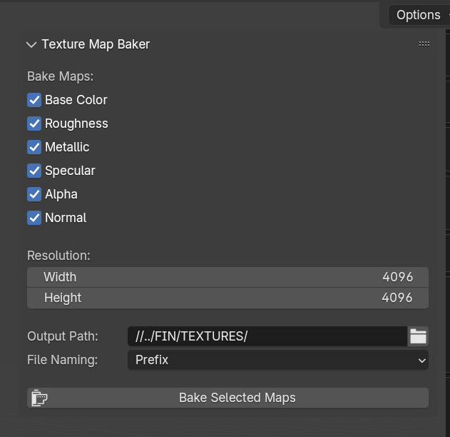

# Blender PBR Texture Baker

A Blender add-on for baking full PBR texture sets (Base Color, Roughness, Metallic, Specular, Alpha, Normal) across **multiple objects** using a **shared, unified UV layout**. Designed for artists who use material-based workflows and need fast batch baking into texture maps — perfect for game asset prep or texture consolidation.

---

## ⚙️ Features

- ✅ Bake **Base Color, Roughness, Metallic, Specular, Alpha, Normal**
- ✅ Supports **multiple selected objects**, each with **multiple materials**
- ✅ Uses the **Emission baking trick** to extract any socket from Principled BSDF
- ✅ Bakes all maps into **shared unified UV** per object — ideal for texture atlas workflows
- ✅ Stores images in correct **color space**: sRGB or Non-Color as required
- ✅ Automatic cleanup of baking nodes and temporary images
- ✅ Live **progress overlay** inside the 3D viewport

---

## ⚠️ Limitations

This addon is designed for **specific use cases**. Please note:

- ❌ It only works with **shared UV islands across all objects**
- ❌ Does **not** support multiple UV maps per material
- ❌ Does **not** support UDIM tile baking
- ❌ Requires objects to use **Principled BSDF**
- ❌ Only supports **Cycles Render Engine** (Eevee is not supported for baking)

---

## 🧠 How It Works

Even though Blender does allow direct baking of some material inputs like Roughness, etc. I find that its not very reliable and takes too long. To solve this, i realised its just best to plug the values of any of the PBR inputs to an emit node and bake that instead.
Here's how the add-on works:

- It **creates a temporary Emission node**
- Connects the target socket (e.g., Roughness) into Emission → bakes as `EMIT`
- After baking, the image is saved and all material changes are **fully cleaned up**

The **Normal map** is baked using Blender’s native `NORMAL` bake type.

---

## 🧪 Tested On

- Blender 4.4+
- Multi-material, multi-object scenes
- Unified UV layouts
- 2K / 4K /custom resolution PNG output
- Windows 11

---

## 🗂 Example Output

Naming can be customized via:
- Prefix (e.g., `MyScene_BaseColor`)
- Suffix (e.g., `BaseColor_MyScene`)
- Both
- Map Name only

---

## 🔧 Installation

1. Download or clone this repo
2. Open Blender → Preferences → Add-ons → Install
3. Select `blender_pbr_texture_baker.py`
4. Enable the addon
5. Go to **3D Viewport → Sidebar → Bake Tab**

